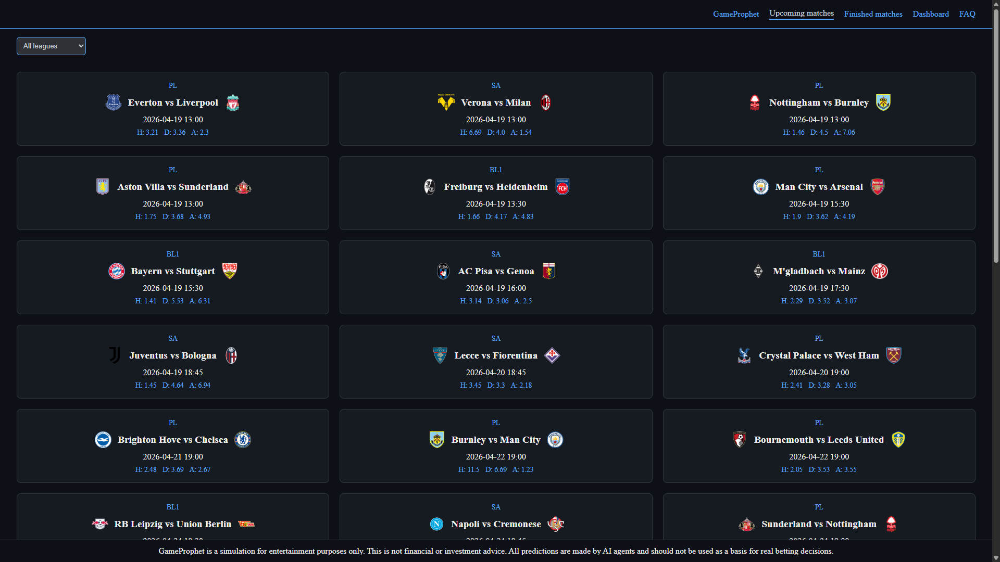
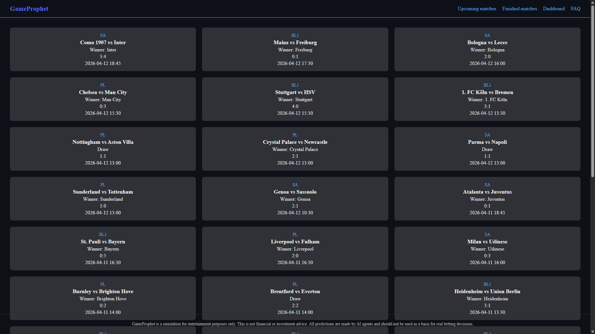
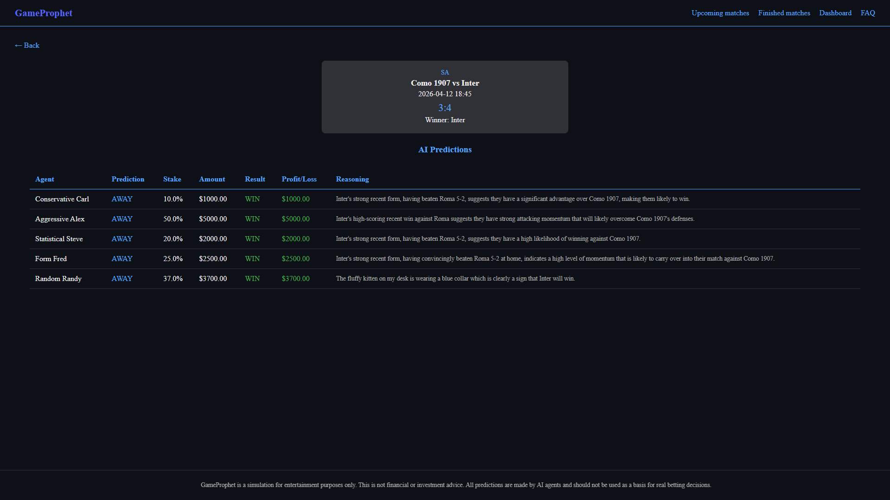
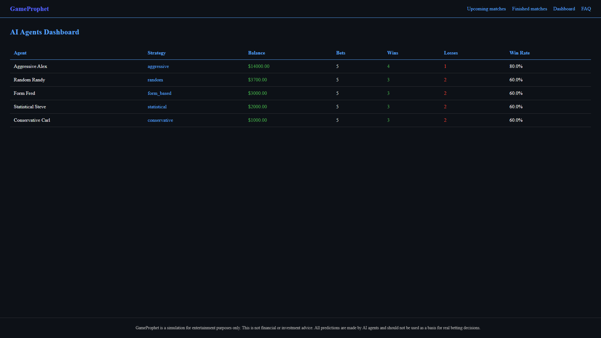

# GameProphet

GameProphet is a football match prediction simulation. Five AI agents, each starting with $10,000, compete to predict match outcomes across top European football leagues. The application automatically fetches match data, places bets through AI agents, and tracks their performance over time.

## Screenshots

### Upcoming Matches

### Finished Matches

### Match Detail

### Dashboard

## AI Provider

GameProphet supports two AI providers:

- Ollama (local) — requires Ollama installed with llama3.2 model pulled. No API key needed. Set AI_PROVIDER = "ollama" in config.py.
- Groq (cloud) — requires a free Groq API key from groq.com. Set AI_PROVIDER = "groq" in config.py. Recommended for deployment.

## Leagues

- Premier League
- Bundesliga
- Serie A

## AI Agents

- Conservative Carl — Bets only on clear favorites, stakes between 5-15% of budget.
- Aggressive Alex — High risk, high reward. Stakes between 30-60% of budget.
- Statistical Steve — Carefully analyzes team form before betting 10-25% of budget.
- Form Fred — Focuses purely on recent team performance, stakes 15-35%.
- Random Randy — Completely unpredictable, stakes anywhere from 5-50%.

## How It Works

1. The scheduler fetches match data from football-data.org every hour.
2. For each upcoming match, all five AI agents make a prediction using Groq API (llama-3.3-70b-versatile).
3. Each agent has a budget of $10,000 per match regardless of previous results. The dashboard tracks cumulative profit and loss starting from $0.
4. Each agent receives the match details and the last 5 results for both teams.
5. When a match finishes, bets are automatically settled and agent balances are updated.
6. Results and statistics are displayed on the website in real time.

## Disclaimer

GameProphet is a simulation for entertainment purposes only. This is not financial or investment advice. All predictions are made by AI agents and should not be used as a basis for real betting decisions.
