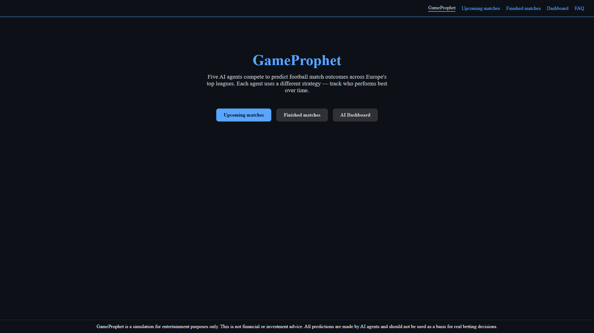
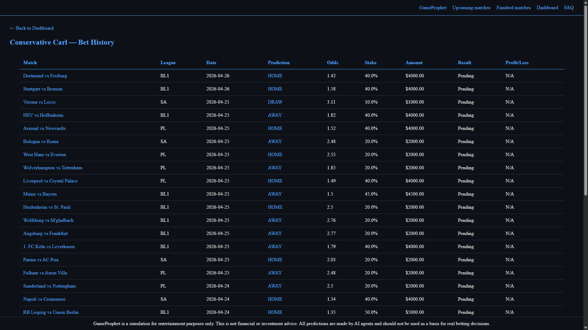

# GameProphet

GameProphet is a football match prediction simulation powered by AI. Five autonomous agents independently analyze upcoming matches and place bets based on their own unique strategy. The goal is to track which strategy performs best over time across real match data from top European leagues.

## Screenshots

### Home Page

### Upcoming Matches

### Finished Matches

### Match Detail

### Dashboard

### Agent Bet History

## Leagues

- Premier League
- Bundesliga
- Serie A

## AI Agents

Each agent has a fixed virtual budget of $10,000 per match. Every match is treated independently — the full $10,000 is available regardless of previous results.

- Conservative Carl — Only bets when highly confident. Stakes between 0% and 60% per match. Will skip matches where data is inconclusive.
- Aggressive Alex — Goes big on every match. Stakes between 20% and 100% per match. Never skips.
- Statistical Steve — Data-driven analyst. Stakes between 0% and 60% per match. Will skip if data is unclear.
- Form Fred — Focuses on recent team momentum. Stakes between 0% and 60% per match. Will skip if form is unclear.
- Random Randy — Completely chaotic. Stakes between 1% and 100% per match. Acts as a random baseline.

## What Data Do Agents Receive

Before making a prediction, each agent receives:

- Home and away team names, league and match date
- Current bookmaker odds averaged across multiple bookmakers
- League standings for both teams — position, points, wins, draws, losses and goal difference
- Average goals scored and conceded per match
- Last 10 home and away games for each team

## How It Works

1. The scheduler runs every hour and fetches the latest match data from football-data.org
2. Bookmaker odds are fetched from The Odds API and updated for all upcoming matches
3. Each agent analyzes upcoming matches and places bets using Llama 3.3 70B via Groq API
4. Agents can choose to skip a match by setting stake to 0% — this decision is final
5. Profit is calculated using real bookmaker odds: profit = stake x odds - stake
6. When a match finishes, bets are automatically settled and agent balances are updated
7. Results and statistics are displayed on the website in real time

## AI Provider

GameProphet supports two AI providers:

- Groq (cloud) — requires a free Groq API key from groq.com. Uses llama-3.3-70b-versatile. Recommended for deployment.
- Ollama (local) — requires Ollama installed with llama3.2 model pulled. No API key needed. Set AI_PROVIDER = "ollama" in config.py.

## Disclaimer

GameProphet is a simulation for entertainment purposes only. This is not financial or investment advice. All predictions are made by AI agents and should not be used as a basis for real betting decisions.
